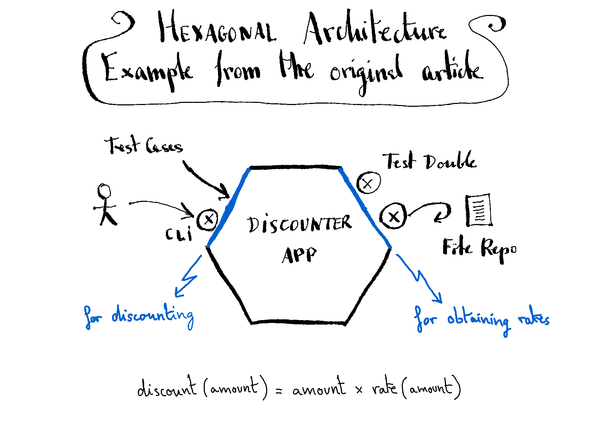

# Discounter

## An implementation of the application included in the "Sample Code" section of "Hexagonal Architecture" pattern.

### By: Juan Manuel Garrido de Paz

__Wednesday, September 7, 2022__

### Description:

The application calculates the discount to substract from a given amount of money (we will assume euros as currency).

The discount is calculated applying a rate to the amount, according to this formula:

discount(amount) = amount * rate(amount)

The rate to apply is read from a file, and it might vary depending on the amount (a different rate value for each amount range). For example:

| Amount from (exclusive) | Amount until (inclusive) | Rate |
|------------------------:|-------------------------:|-----:|
|                       0 |                       20 |    0 |
|                      20 |                       50 | 0.15 |
|                      50 |                      100 | 0.33 |
|                     100 |                          | 0.50 |

### Development sequence:

| Step # | Driver                       | Rate repository    |
|:------:|:-----------------------------|:-------------------|
|   1    | Test cases                   | None               |
|   2    | Test cases                   | Test double (stub) |
|   3    | CLI (Command Line Interface) | Test double (stub) |
|   4    | CLI (Command Line Interface) | File               |
